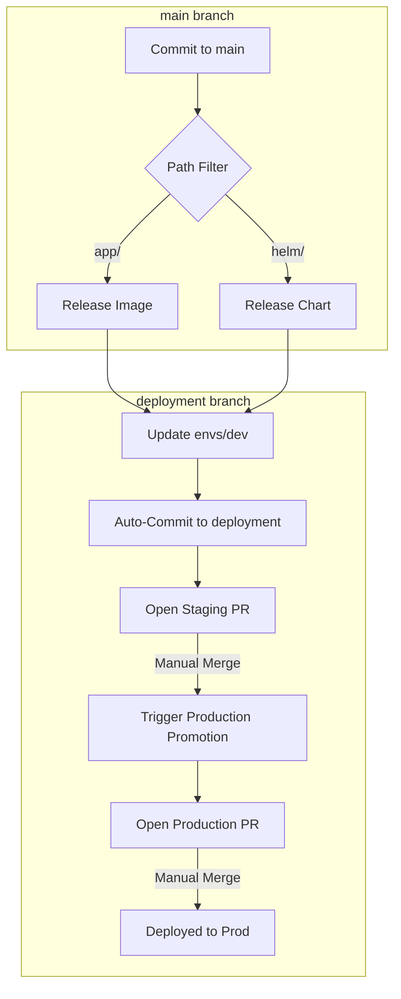

# GitOps All-In-One Dual-Branch Demo (ps-demo-all-in-one-branch)

This repository is a fully automated GitOps demonstration. It manages a Dockerized application, its Helm chart, and environment-specific configurations (Dev, Stage, Prod) across two branches, featuring cascading automated promotion via Pull Requests on the deployment branch.

---

## 🚀 Developer Perspective

As a developer, your primary focus is the `app/` and `helm/` directories on the `main` branch.

### Folder Structure (main branch)
- **`app/`**: Contains the Nginx-based static application and `Dockerfile`.
- **`helm/`**: Contains the Kubernetes manifests (Helm chart) for the application.

### Workflow
1.  **Conventional Commits**: We use [Conventional Commits](https://www.conventionalcommits.org/) to drive automated versioning.
    - Use `feat(app): ...` or `fix(app): ...` for application changes.
    - Use `feat(helm): ...` or `fix(helm): ...` for Helm chart changes.
2.  **Local Testing**:
    - Build locally: `docker build -t ps-demo-all-in-one-branch ./app`
    - Lint Helm: `helm lint helm/`
3.  **Automatic Release**: Once you push to `main`, the CI builds a new image/chart and automatically updates the `dev` environment in the `deployment` branch.

---

## ⚙️ DevOps Perspective

The operational core of this repo relies on GitHub Actions and a dual-branch strategy to isolate environment state from source code.

### Automation Components
- **Versioning**: Two independent `semantic-release` instances manage versions for the App and the Helm Chart separately on the `main` branch.
- **OCI Registry**: Artifacts are pushed to `ghcr.io`.
- **GitOps Values**: Environment states are stored in the `envs/` directory, which exists **only** on the `deployment` branch.

### Workflow Logic
1.  **Job: `release-app` / `release-helm`**: Detects changes in `main` and publishes new versions to GHCR.
2.  **Job: `deploy-dev-and-promote-stage`**: 
    - **Safety Gate**: This job only executes if the respective build jobs were successful. If a build fails, no environments are updated.
    - **Cross-Branch Sync**: Checkouts the `deployment` branch to update `envs/dev/values.yaml`.
    - **PR Creation**: Directly commits the dev update to `deployment` and opens a **Staging Pull Request** (base: `deployment`, head: `promote-dev-to-stage`).
3.  **Workflow: `Promote to Production`**: Triggered by merged PRs on the `deployment` branch. It syncs `stage` to `prod` within the same branch and opens a **Production Pull Request**.

---

## 🔄 The Full Workflow

---

## 📋 Assumptions

### Explicit Assumptions
- **Conventional Commits**: The release logic *only* triggers on `feat` or `fix` prefixes.
- **GHCR**: We assume the GitHub Container Registry is used for both Docker images and Helm charts.
- **Permissions**: The `GITHUB_TOKEN` must have "Read and write permissions" and "Allow GitHub Actions to create and approve pull requests" enabled in repository settings.

### Implicit Assumptions
- **Separation of Concerns**: The `main` branch stays clean of environment version noise.
- **Atomic Promotion**: Environment updates are promoted stage-by-stage via PR approval.
- **Manual Gates**: While `dev` is auto-updated, `stage` and `prod` require a human to merge the PR, acting as a manual approval gate.

---

## ⚖️ Advantages & Drawbacks

### Advantages
- **Clean Main Branch**: Source history is not cluttered with "chore: update version" commits.
- **Traceability**: Environment state is strictly tracked in the `deployment` branch history.
- **Safety**: Build failures prevent downstream environment updates.
- **Simplicity**: No external GitOps tools required for state management.

### Drawbacks
- **Branch Management**: Requires managing two long-lived branches (`main` and `deployment`).
- **PR Noise**: Every minor change in `main` initiates a cascading PR chain on the `deployment` branch.
- **Context Switching**: Developers must switch to the `deployment` branch to review/merge promotions.
