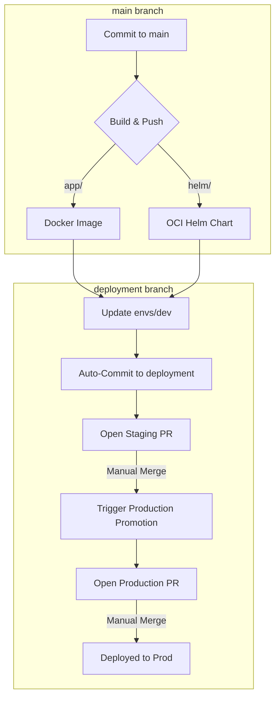

# GitOps Dual-Branch Demo (ps-demo-all-in-one-branch)

This repository is a fully automated GitOps demonstration featuring a **Dual-Branch Architecture**. It separates the application source code and Helm templates from the environment-specific deployment states.

---

## 🏗️ Architecture

### Branching Strategy
- **`main` Branch**: 
  - **Purpose**: Source of truth for Application code and Helm Chart templates.
  - **Content**: `app/`, `helm/`, CI workflows, and project metadata.
  - **History**: Focuses on development changes and feature additions.
- **`deployment` Branch**:
  - **Purpose**: State of truth for all environments (Dev, Stage, Prod).
  - **Content**: `envs/` directory containing `values.yaml` for each stage.
  - **History**: Tracks every version bump and configuration change across environments.

---

## 🔄 The Dual-Branch Workflow

### 1. Automated Release (`main` -> `deployment`)
When a change is pushed to `main`, the **Release** workflow:
1.  Calculates semantic versions for the App and/or Chart.
2.  Builds and pushes artifacts to GHCR.
3.  **Safety Check**: If any build fails, the process stops immediately.
4.  **Sync**: The workflow checkouts the `deployment` branch, updates `envs/dev/values.yaml`, and commits directly.
5.  **Staging PR**: Automatically opens a PR from `promote-dev-to-stage` to `deployment`.

### 2. Environment Promotion (within `deployment`)
Merging a promotion PR on the `deployment` branch triggers the **Promote to Production** workflow:
1.  Detects changes in `envs/stage/values.yaml`.
2.  Syncs the versions to `envs/prod/values.yaml`.
3.  Opens a PR for the final Production approval.

---

## 🚀 Key Features

- **Isolation**: Environment noise (version bumps) never touches the `main` branch code history.
- **Build Integrity**: Deployments to `dev` and promotions to `stage` are blocked if Docker or Helm builds fail.
- **Atomic Promotions**: Supports independent or simultaneous updates of the Application and the Helm Chart.
- **Pull Request Gates**: `stage` and `prod` deployments require manual PR approval, serving as human-in-the-loop gates.

---

## 🛠️ Usage for Developers

1.  **App Change**: Prefix your commit with `feat(app):` or `fix(app):`.
2.  **Helm Change**: Prefix your commit with `feat(helm):` or `fix(helm):`.
3.  **Promotion**: Navigate to the `deployment` branch on GitHub to find and merge the automated PRs.

---

## 📋 Repository Configuration Requirements

To function correctly, the following **GitHub Actions Permissions** are required (**Settings > Actions > General**):
- **Workflow permissions**: Read and write permissions.
- **Allow GitHub Actions to create and approve pull requests**: Checked.
